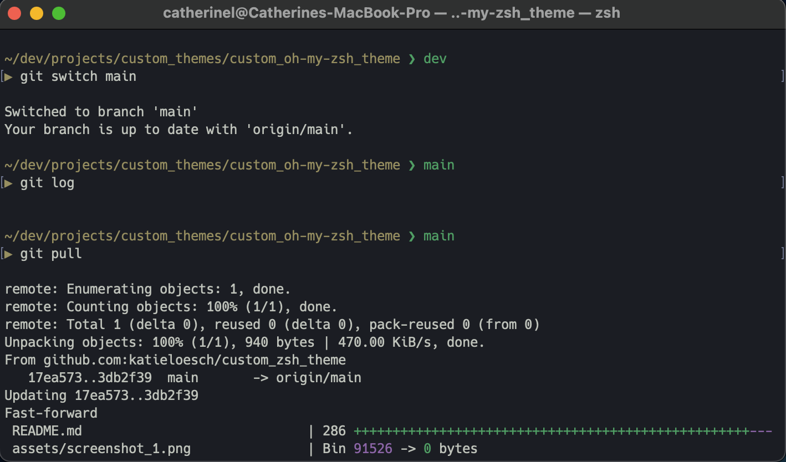
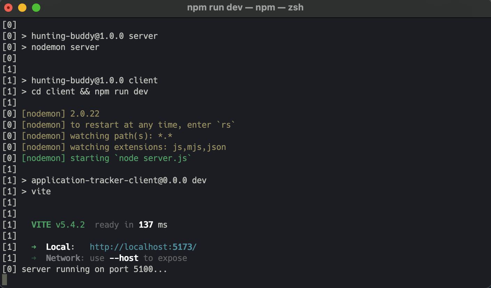
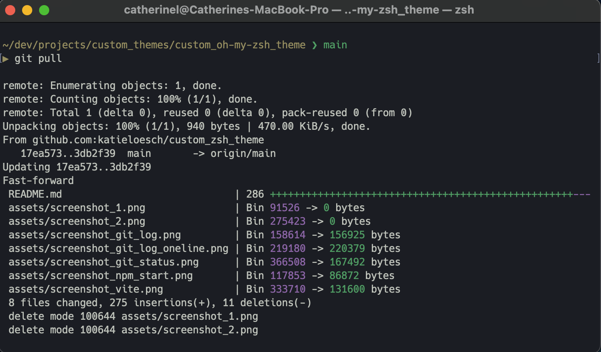

# Custom Minimalist Oh My Zsh Theme

<div align="center">
  
  <br><br>
  
</div>

## Overview

1. [Description](#description)
2. [Prerequisites - MacOS](#prerequisites-mac)
3. [Installation - MacOS](#installation-mac)
4. [Prerequisites - Linux](#prerequisites-linux)
5. [Installation - Linux](#installation-linux)
6. [Prerequisites - WSL](#prerequisites-wsl)
7. [Installation - WSL](#installation-wsl)
8. [Customising ANSI Colors](#ansi)
9. [Customising fonts](#fonts)
10. [Plugins](#plugins)
11. [Development Tools & Resources Used](#technologies)
12. [Shell Configuration Code Walkthrough](#code)

---

## <a name="description"></a> 1. Description

A sleek and minimalist **Oh My Zsh** theme designed for an enhanced terminal experience, inspired by the [Andromeda Mariana](https://marketplace.visualstudio.com/items?itemName=lakshits11.best-themes-redefined) theme for VS Code by [Lakshit Somani](https://github.com/lakshits11/).

Like Andromeda Mariana, this custom theme features a dark background, reducing overall screen brightness to minimize eye strain—especially in low-light environments. Its soft, muted color palette helps prevent visual fatigue by avoiding harsh contrasts, creating a comfortable and aesthetically pleasing workspace.

<div align="center">
  
  <br><br>
  
  <br><br>
  
</div>

## <a name="prerequisites-mac"></a> 2. Prerequisites - MacOS

### To use this theme, you must have:

- Oh My Zsh installed
- Zsh set as your default shell

### Compatibility:

✅&nbsp;&nbsp;Supported

- macOS & Linux – Fully supported
- Windows (WSL) – Supported with WSL + Nerd Fonts for proper icon rendering

<br>

❌&nbsp;&nbsp;Not Supported

- Git Bash – Oh My Zsh does not work in Git Bash
- Windows CMD/PowerShell – Zsh is not natively supported
  - For the best experience on Windows, use WSL with Ubuntu and Windows Terminal

---

### **Check if Oh My Zsh is Installed**

- In your terminal, run:

  ```sh
  echo $ZSH
  ```

- If installed, it will return a path like:
  ```
  /Users/your-username/.oh-my-zsh
  ```
- If empty, **Oh My Zsh is not installed**.

---

### **Check if Zsh is the Default Shell**

- In your terminal, run:

  ```sh
  echo $SHELL
  ```

- If it returns `/bin/zsh`, Zsh is already set as the default shell.
- If it returns `/bin/bash`, switch to Zsh with:
  ```sh
  chsh -s $(which zsh)
  ```
- Then restart your terminal.

---

### **Verify Oh My Zsh Configuration**

- Check if the `~/.zshrc` file exists by running:

  ```sh
  ls -la ~/.zshrc
  ```

- If the file exists, **Oh My Zsh is installed**.
- If not, proceed with installation.

---

### **Install Oh My Zsh (If Needed)**

- If Oh My Zsh is not installed, install it with the following command:

  ```sh
  sh -c "$(curl -fsSL https://raw.github.com/ohmyzsh/ohmyzsh/master/tools/install.sh)"
  ```

- Or use `wget`:

  ```sh
  sh -c "$(wget https://raw.github.com/ohmyzsh/ohmyzsh/master/tools/install.sh -O -)"
  ```

- After installation, restart your terminal or run:

  ```sh
  source ~/.zshrc
  ```

## <a name="installation-mac"></a> 3. Installing the Custom Oh My Zsh Theme on MacOS

### **Step 1: Navigate to the Oh My Zsh Custom Themes Directory**

```sh
cd ~/.oh-my-zsh/custom/themes
```

- If the directory does not exist, create it:

  ```sh
  mkdir -p ~/.oh-my-zsh/custom/themes
  ```

### **Step 2: Download the Theme**

- #### **Option 1: Clone the Repository**

  ```sh
  git clone https://github.com/katieloesch/custom_oh-my-zsh_theme
  ```

- #### **Option 2: Download the Theme File Directly**

  - Using `curl`:

    ```sh
    curl -o ~/.oh-my-zsh/custom/themes/custom_zsh_theme.zsh-theme https://raw.githubusercontent.com/katieloesch/custom_oh-my-zsh_theme/main/custom_zsh_theme.zsh-theme
    ```

  - Using `wget`:

    ```sh
    wget -O ~/.oh-my-zsh/custom/themes/custom_zsh_theme.zsh-theme https://raw.githubusercontent.com/katieloesch/custom_oh-my-zsh_theme/main/custom_zsh_theme.zsh-theme
    ```

### **Step 3: Verify the Theme File**

- Ensure the file is in the correct directory:

  ```sh
  ls ~/.oh-my-zsh/custom/themes/
  ```

- You should see `custom_zsh_theme.zsh-theme` in the list.

### **Step 4: Set the Theme in `.zshrc`**

- Open the configuration file:

  ```sh
  open ~/.zshrc
  ```

- Find the line:

  ```sh
  ZSH_THEME="robbyrussell"
  ```

- Change it to:

  ```sh
  ZSH_THEME="custom_zsh_theme"
  ```

- Save and exit close the file.

### **Step 5: Apply Changes**

```sh
source ~/.zshrc
```

### **Troubleshooting**

- If the theme doesn’t apply, ensure the `.zsh-theme` file is in the correct location.
- Restart your terminal if `source ~/.zshrc` does not work.

## <a name="prerequisites-linux"></a> 4. Prerequisites - Linux

To use this theme, you must have:

- **Oh My Zsh** installed
- **Zsh** set as your default shell

---

### **Check if Oh My Zsh is Installed**

- Run:
  ```sh
  echo $ZSH
  ```
- If installed, it will return a path like:
  ```
  /home/your-username/.oh-my-zsh
  ```
- If empty, **Oh My Zsh is not installed**.

---

### **Check if Zsh is the Default Shell**

- Run:

  ```sh
  echo $SHELL
  ```

- If it returns `/bin/zsh`, Zsh is already set as the default shell.
- If it returns `/bin/bash`, switch to Zsh with:
  ```sh
  chsh -s $(which zsh)
  ```
  Then restart your terminal.

---

### **Verify Oh My Zsh Configuration**

- Check if the `~/.zshrc` file exists:

```sh
ls -la ~/.zshrc
```

- If the file exists, **Oh My Zsh is installed**.
- If not, proceed with installation.

---

### **Install Oh My Zsh (If Needed)**

- Run:

  ```sh
  sh -c "$(curl -fsSL https://raw.github.com/ohmyzsh/ohmyzsh/master/tools/install.sh)"
  ```

- Or use `wget`:

  ```sh
  sh -c "$(wget https://raw.github.com/ohmyzsh/ohmyzsh/master/tools/install.sh -O -)"
  ```

- After installation, restart your terminal or run:

  ```sh
  source ~/.zshrc
  ```

---

## <a name="installation-linux"></a> 5. Installing the Custom Oh My Zsh Theme on Linux

### **Step 1: Navigate to the Oh My Zsh Custom Themes Directory**

```sh
cd ~/.oh-my-zsh/custom/themes
```

- If the directory does not exist, create it:
  ```sh
  mkdir -p ~/.oh-my-zsh/custom/themes
  ```

### **Step 2: Download the Theme**

- Option 1: Clone the Repository
  ```sh
  git clone https://github.com/katieloesch/custom_oh-my-zsh_theme
  ```
- Option 2: Download the Theme File Directly
  - using `curl`:
    ```sh
    curl -o ~/.oh-my-zsh/custom/themes/custom_zsh_theme.zsh-theme https://raw.githubusercontent.com/katieloesch/custom_oh-my-zsh_theme/main/custom_zsh_theme.zsh-theme
    ```
  - or using `wget`:
    ```sh
    wget -O ~/.oh-my-zsh/custom/themes/custom_zsh_theme.zsh-theme https://raw.githubusercontent.com/katieloesch/custom_oh-my-zsh_theme/main/custom_zsh_theme.zsh-theme
    ```

### **Step 3: Verify the Theme File**

- Ensure the file is in the correct directory:

  ```sh
  ls ~/.oh-my-zsh/custom/themes/
  ```

- You should see `custom_zsh_theme.zsh-theme` in the list.

### **Step 4: Set the Theme in `.zshrc`**

- Open the configuration file:
  ```sh
  nano ~/.zshrc
  ```
- Find the line:
  ```sh
  ZSH_THEME="robbyrussell"
  ```
- Change it to:
  ```sh
  ZSH_THEME="custom_zsh_theme"
  ```
- Save file and exit.

### **Step 5: Apply Changes**

```sh
source ~/.zshrc
```

### **Troubleshooting**

- If the theme doesn’t apply, ensure the `.zsh-theme` file is in the correct location.
- Restart your terminal if `source ~/.zshrc` does not work.
- Some themes require **Nerd Fonts**—install one if your icons aren’t displaying correctly.

## <a name="prerequisites-wsl"></a> 6. Prerequisites - WSL

To use this theme, you must have:

- WSL Installed (Windows Subsystem for Linux)
- Ubuntu or another Linux distro installed in WSL
- Oh My Zsh installed
- Zsh set as your default shell
- Windows Terminal (recommended for best results)

## **Install and Configure WSL**

### **Step 1: Enable WSL**

- Run the following command in PowerShell (Admin):

  ```powershell
  wsl --install
  ```

- Restart your computer.

### **Step 2: Install Ubuntu (or another Linux distro)**

- Open PowerShell and run:

  ```powershell
  wsl --install -d Ubuntu
  ```

- Launch Ubuntu from the Start menu and complete the setup.

### **Step 3: Install Zsh**

- Inside your **Ubuntu terminal**:

  ```sh
  sudo apt update && sudo apt install zsh -y
  ```

### **Step 4: Install Oh My Zsh**

```sh
sh -c "$(curl -fsSL https://raw.github.com/ohmyzsh/ohmyzsh/master/tools/install.sh)"
```

- or use `wget`:

  ```sh
  sh -c "$(wget https://raw.github.com/ohmyzsh/ohmyzsh/master/tools/install.sh -O -)"
  ```

### **Step 5: Set Zsh as the Default Shell**

```sh
chsh -s $(which zsh)
```

- Restart your **Windows Terminal** to apply changes.

## <a name="installation-wsl"></a> 7. Installing the Custom Oh My Zsh Theme on WSL

### **Step 1: Navigate to the Oh My Zsh Custom Themes Directory**

```sh
cd ~/.oh-my-zsh/custom/themes
```

- If the directory does not exist, create it:

  ```sh
  mkdir -p ~/.oh-my-zsh/custom/themes
  ```

### **Step 2: Download the Theme**

- Option 1: Clone the Repository

  ```sh
  git clone https://github.com/katieloesch/custom_oh-my-zsh_theme
  ```

- Option 2: Download the Theme File Directly
  - Using `curl`:
    ```sh
    curl -o ~/.oh-my-zsh/custom/themes/custom_zsh_theme.zsh-theme https://raw.githubusercontent.com/katieloesch/custom_oh-my-zsh_theme/main/custom_zsh_theme.zsh-theme
    ```
  - or Using `wget`:
    ```sh
    wget -O ~/.oh-my-zsh/custom/themes/custom_zsh_theme.zsh-theme https://raw.githubusercontent.com/katieloesch/custom_oh-my-zsh_theme/main/custom_zsh_theme.zsh-theme
    ```

### **Step 3: Verify the Theme File**

```sh
ls ~/.oh-my-zsh/custom/themes/
```

- You should see `custom_zsh_theme.zsh-theme` in the list.

### **Step 4: Set the Theme in `.zshrc`**

```sh
nano ~/.zshrc
```

- Find:

```sh
ZSH_THEME="robbyrussell"
```

- Change it to:

```sh
ZSH_THEME="custom_zsh_theme"
```

- Save and exit.

### **Step 5: Apply Changes**

```sh
source ~/.zshrc
```

### **Troubleshooting**

- Install MesloLGS NF (Nerd Font) for proper icon rendering.
- Ensure Windows Terminal is used for full color support.

## <a name="ansi"></a> 8. Customising ANSI Colors

Changing ANSI colors in your terminal allows you to customize its appearance for better readability and aesthetics.

## **Customising ANSI Colors for macOS**

- **Option 1: Using Terminal Preferences (for Built-in macOS Terminal)**

  1. Open Terminal (`Command + Space` → type `Terminal` → press `Enter`).
  2. Click on **Terminal** in the menu bar and select **Settings** (or **Preferences** in older versions).
  3. Go to the **Profiles** tab.
  4. Choose a profile to edit or create a new one by clicking the **"+"** button.
  5. Click the **"Text"** tab and select **"Change..."** next to "ANSI Colors".
  6. Adjust the colors as needed by clicking each square and choosing a new color.
  7. Click **Save**. You can also set the profile as **default**.

- **Option 2: Using Zsh and `.zshrc` (for iTerm2 or Alacritty)**
  If you're using **iTerm2**, you can set ANSI colors via the preferences, or by modifying the `.zshrc` file:
  1. Open the **iTerm2** application.
  2. Go to **Preferences** → **Profiles** → **Colors**.
  3. Adjust ANSI colors by clicking the color boxes.
  4. Alternatively, edit your **~/.zshrc** file to add custom ANSI colors:
  ```sh
   export LS_COLORS='di=1;34:ln=36:so=32:pi=33:ex=1;32:bd=34;46:cd=34;43'
  ```
  5. Save and apply changes with:
  ```sh
  source ~/.zshrc
  ```

## **Customising ANSI Colors for Linux (Ubuntu, Fedora, Arch, etc.)**

- **Method 1: Editing `.bashrc` or `.zshrc` for Persistent Changes**
  1. Open a terminal.
  2. Edit the shell configuration file:
     - **Bash:** `nano ~/.bashrc`
     - **Zsh:** `nano ~/.zshrc`
  3. Add custom ANSI color settings. Example for **LS_COLORS**:
  ```sh
  export LS_COLORS='di=1;34:ln=36:so=32:pi=33:ex=1;32:bd=34;46:cd=34;43'
  ```
  4. Save the file (`Ctrl + X`, then `Y`, then `Enter`).
  5. Apply the changes:
  ```sh
  source ~/.bashrc   # or source ~/.zshrc
  ```
- **Method 2: Using `dircolors`**
  1. Generate a new **LS_COLORS** scheme:
  ```sh
  dircolors -p > ~/.dircolors
  ```
  2. Edit the file:
  ```sh
  nano ~/.dircolors
  ```
  3. Modify color settings (e.g., change directories to bold blue):
  ```
  DIR 01;34
  ```
  4. Save and apply:
  ```sh
  eval "$(dircolors -b ~/.dircolors)"
  ```

## **Customising ANSI Colors for Windows Subsystem for Linux (WSL)**

- **Method 1: Changing Colors in Windows Terminal (GUI)**

  1. Open **Windows Terminal** (PowerShell, WSL, or CMD).
  2. Click the **dropdown menu** (⌄) and select **Settings**.
  3. Choose your WSL profile (e.g., "Ubuntu").
  4. Under the **Appearance** tab, scroll to **Color Scheme** and click **Edit**.
  5. Modify ANSI color values and save the changes.

- **Method 2: Editing `.bashrc` or `.zshrc` for WSL**
  1. Open WSL (`Ctrl + Alt + T` or from Windows Terminal).
  2. Edit the shell configuration file:
  ```sh
  nano ~/.bashrc   # or ~/.zshrc
  ```
  3. Add custom ANSI colors:
  ```sh
  export LS_COLORS='di=1;34:ln=36:so=32:pi=33:ex=1;32:bd=34;46:cd=34;43'
  ```
  4. Save and reload:
  ```sh
  source ~/.bashrc   # or source ~/.zshrc
  ```

## **Testing Your ANSI Colors**

- After applying changes, test your ANSI colors with:
  ```sh
  ls --color=auto
  echo -e "\e[31mRed Text\e[0m"
  ```

## <a name="fonts"></a> 9. Customising fonts

Changing the font in your terminal improves readability and aesthetics, especially for coding and command-line work.

## **Change or Add Fonts in Terminal on macOS**

- **Method 1: Change Font in Built-in macOS Terminal**
  1. Open **Terminal** (`Command + Space` → type `Terminal` → press `Enter`).
  2. Click **Terminal** in the menu bar and select **Settings** (or **Preferences**).
  3. Navigate to the **Profiles** tab.
  4. Choose the profile you want to modify.
  5. Click the **"Text"** tab.
  6. Under **Font**, click **Change** and select a font from the list.
  7. Adjust size and anti-aliasing settings if needed.
  8. Click **Save** to apply the changes.
- **Method 2: Change Font in iTerm2**
  1. Open **iTerm2**.
  2. Click **iTerm2 → Preferences**.
  3. Select the **Profiles** tab.
  4. Under the **Text** tab, locate **Font**.
  5. Click **Change Font** and select your preferred font.
  6. Adjust **size**, **ligatures**, and **anti-aliasing** as needed.

## **Change or Add Fonts in Terminal on Linux (Ubuntu, Fedora, Arch, etc.)**

- **Method 1: Change Font in GNOME Terminal**
  1. Open **GNOME Terminal**.
  2. Click the **hamburger menu (☰)** in the top-right corner.
  3. Select **Preferences**.
  4. Choose your profile (default or custom).
  5. Scroll to the **Text Appearance** section.
  6. Toggle **Custom font** on.
  7. Click the font name and choose a new font.
  8. Adjust size and apply the changes.
- **Method 2: Change Font in Konsole (KDE Terminal)**
  1. Open **Konsole**.
  2. Click **Settings → Edit Current Profile**.
  3. Navigate to the **Appearance** tab.
  4. Click **Select Font** and pick a new font.
  5. Click **OK** and apply changes.
- **Method 3: Change Font in Alacritty (YAML Config)**

  1. Open or create the **Alacritty config file**:

  ```sh
  nano ~/.config/alacritty/alacritty.yml
  ```

  2. Locate or add the `font` section:

  ```yaml
  font:
    normal:
      family: 'Fira Code'
      style: 'Regular'
    size: 12
  ```

  3. Save (`Ctrl + X`, then `Y`, then `Enter`) and restart Alacritty.

- **Method 4: Change Font in Kitty (GPU-based Terminal)**
  1. Open the Kitty config file:
  ```sh
  nano ~/.config/kitty/kitty.conf
  ```
  2. Add or modify:
  ```sh
  font_family FiraCode
  font_size 12
  ```
  3. Save and restart Kitty.

## **Change or Add Fonts in Terminal on Windows Subsystem for Linux (WSL)**

- ### **Method 1: Change Font in Windows Terminal**
  1. Open **Windows Terminal**.
  2. Click the **dropdown menu (⌄)** and select **Settings**.
  3. Choose the profile you want to modify (e.g., "Ubuntu").
  4. Scroll down to the **Appearance** section.
  5. Under **Font Face**, select a new font from the dropdown.
  6. Click **Save** to apply changes.
- ### **Method 2: Change Font in WSL's Linux Terminal (GNOME/Konsole)**
  - Follow the Linux instructions for GNOME Terminal, Konsole, or Alacritty, depending on your terminal emulator.

## **Installing New Fonts**

If your preferred font isn't available, you can install it:

### **macOS**

1. Download a `.ttf` or `.otf` font from [Google Fonts](https://fonts.google.com/) or [Nerd Fonts](https://www.nerdfonts.com/).
2. Double-click the font file and click **Install**.
3. Restart the terminal and select the new font.

### **Linux**

1. Download the font file (`.ttf` or `.otf`).
2. Move it to the fonts directory:
   ```sh
   mkdir -p ~/.local/share/fonts
   mv font-file.ttf ~/.local/share/fonts/
   ```
3. Refresh the font cache:
   ```sh
   fc-cache -fv
   ```
4. Restart your terminal.

### **Windows (for WSL)**

1. Download a font from a trusted source.
2. Double-click the `.ttf` or `.otf` file and click **Install**.
3. Open Windows Terminal, go to **Settings**, and select the new font.

### **Recommended Fonts for Terminals**

- [Hack](https://github.com/source-foundry/Hack) → Lightweight, clear characters
- [Fira Code](https://github.com/tonsky/FiraCode) → Monospace, includes ligatures
- [JetBrains Mono](https://github.com/JetBrains/JetBrainsMono) → Great readability
- [Ubuntu Mono](https://fonts.google.com/specimen/Ubuntu+Mono) → Default in Ubuntu
- [Cascadia Code](https://github.com/microsoft/cascadia-code) → Microsoft’s modern monospaced font
- [Droid Sans Mono](https://www.fontsquirrel.com/fonts/droid-sans-mono) → Minimalist and sharp

## <a name="plugins"></a> 10. Plugins

Another way of customising your terminal is to add plugins. Plugins enhance your terminal experience by adding features such as auto-suggestions, syntax highlighting, and improved navigation.

## **Oh My Zsh Plugins (macOS, Linux, WSL)**

- **Enable Built-in Plugins**
  1. Open your **Zsh configuration file**:
  ```sh
  nano ~/.zshrc
  ```
  2. Locate the **plugins** line:
  ```sh
  plugins=(git zsh-autosuggestions)
  ```
  3. Add any additional plugins you want (space-separated).
  4. Save and apply changes:
  ```sh
  source ~/.zshrc
  ```
- **Install New Plugins** (Manually or via Git)
  - Example: Install `zsh-autosuggestions`
    1. Clone the plugin repository into the **Oh My Zsh** custom plugins directory:
    ```sh
    git clone https://github.com/zsh-users/zsh-autosuggestions ${ZSH_CUSTOM:-~/.oh-my-zsh/custom}/plugins/zsh-autosuggestions
    ```
    2. Edit `~/.zshrc` and add `zsh-autosuggestions` to the `plugins=()` list:
    ```sh
    plugins=(git zsh-autosuggestions)
    ```
    3. Reload Zsh:
    ```sh
    source ~/.zshrc
    ```

#### **Other Useful Zsh Plugins**

- [zsh-syntax-highlighting](https://github.com/zsh-users/zsh-syntax-highlighting/blob/master/INSTALL.md) → Colorizes commands as you type
- [zsh-completions](https://github.com/zsh-users/zsh-completions) → Adds additional autocomplete support
- [powerlevel10k](https://github.com/romkatv/powerlevel10k) → A highly customizable prompt

#### **Troubleshooting**

- Always restart your shell (`source ~/.zshrc`) after changes.
- Check installed plugins with `echo $plugins`.
- If a plugin doesn't work, ensure dependencies like `git` and `curl` are installed.

## <a name="technologies"></a> 11. Development Tools & Resources Used

### Development Tools

- **Git / GitHub** (v2.39.5)
  - <sub>used for version control and collaboration</sub>
  - <sub>[Git website](https://git-scm.com/)</sub>
  - <sub>[Git documentation](https://git-scm.com/doc)</sub>
  - <sub>[GitHub website](https://github.com/)</sub>
  - <sub>[GitHub documentation](https://docs.github.com/en)</sub>
- **Visual Studio Code (VSCode)** (v1.96.4)
  - <sub>code editor used for development</sub>
  - <sub>[website](https://code.visualstudio.com/)</sub>
  - <sub>[GitHub repository](https://github.com/microsoft/vscode)</sub>
  - <sub>[documentation](https://code.visualstudio.com/docs)</sub>
- **ChatGPT4o**
  - <sub>generative AI tool used for debugging and development support</sub>
  - <sub>[website](https://chat.openai.com/)</sub>
  - <sub>[GitHub repository](https://github.com/openai)</sub>

### Resources & Tutorials

- **Documentation**
  - ohmyzsh
    - <sub>[github repository](https://github.com/ohmyzsh/ohmyzsh)</sub>
    - <sub>[website](https://ohmyz.sh/)</sub>
  - nerdfonts
    - <sub>[github repository](https://github.com/ryanoasis/nerd-fonts)</sub>
    - <sub>[website](https://www.nerdfonts.com/)</sub>
    - <sub>font used in demo: [Hack](https://github.com/source-foundry/Hack) Nerd Font Mono v3.003 by [Chris Simpkins](https://github.com/chrissimpkins)</sub>
- **Blogs**
  - <sub>[Customizing your Terminal — Becoming a zsh Power User](https://medium.com/@sammykerridge/customizing-your-terminal-becoming-a-zsh-power-user-d9a8aab5aad0) by [Sam Kerridge](https://medium.com/@sammykerridge)</sub>
  - <sub>[How I customise my Terminal with Oh My Zsh (macOS)](https://dev.to/hannahgooding/how-i-customise-my-terminal-with-oh-my-zsh-macos-427i) by [Hannah Gooding](https://dev.to/hannahgooding)</sub>
- **YouTube**
  - <sub>[Make Your Mac Terminal Beautiful in Under 10 Minutes! [Oh My Zsh & Powerlevel10k]](https://www.youtube.com/watch?v=9eJ0HHHNuls) by [Jake Fishman](https://www.youtube.com/@JakeFishmanTech)</sub>
  - <sub>[How to setup your Mac Terminal to be beautiful](https://www.youtube.com/watch?v=wNQpDWLs4To) by [typecraft](https://www.youtube.com/@typecraft_dev)</sub>
  - <sub>[Upgrade your Terminal NOW | How to install ZSH, oh-my-zsh, themes and plugins](https://www.youtube.com/watch?v=yqKimk-AFY8) by [Helping Ninja](https://www.youtube.com/@helpingninja)</sub>
  - <sub>[Make Your Terminal Look Cooler (OMZ + P10k + Starship)](https://www.youtube.com/watch?v=WXiNkZVmkD4) by [warpdotdev](https://www.youtube.com/@warpdotdev)</sub>

---

## <a name="code"></a> 12. Shell Configuration Code Walkthrough

This configuration for customizing the Zsh shell prompt is a user-friendly and informative terminal prompt that's particularly useful for developers working in Git repositories. It dynamically adjusts the prompt based on the current working directory and Git branch, using custom colors and symbols.

The script customizes the Zsh prompt with the (shortened) current working directory and the active Git branch (if applicable). It also uses colors and symbols to improve readability and aesthetics.
Finally, it prints an empty line before each command for better output separation.

---

### **Git Prompt Prefix and Suffix Definition**

- The following 2 lines define the appearance of the Git branch prompt:

  ```zsh
  ZSH_THEME_GIT_PROMPT_PREFIX="%{$fg[green]%}❯ "
  ZSH_THEME_GIT_PROMPT_SUFFIX="%{$fg[green]%} "
  ```

  - in this case, the prefix is set to a green `❯` symbol
  - and the suffix is set to a space
  - `%{$fg[green]%}` is a Zsh escape sequence that sets the text color to green

---

### **path_prompt Function**

```zsh
function path_prompt {
  echo $(pwd | sed -e "s,^$HOME,~,")
}
```

- This function generates a shortened path for the prompt:
  - It uses `pwd` to get the current working directory.
  - `sed` replaces the home directory with a tilde `~` to make the path more compact

---

### **git_custom_prompt Function**

- The following function adds Git branch information to the prompt:

  ```zsh
  function git_custom_prompt {
    local cb=$(git_current_branch)
    if [ -n "$cb" ]; then
      echo "$ZSH_THEME_GIT_PROMPT_PREFIX${cb}$ZSH_THEME_GIT_PROMPT_SUFFIX"
    fi
  }
  ```

  - `git_current_branch` retrieves the current Git branch name
  - If a branch exists (`-n "$cb"` checks if the variable is non-empty), the branch name is displayed
  - The branch name is wrapped with the prefix (in this case `❯`) and suffix (in this case a space)

---

### **ret_status Definition**

- The following line defines a status indicator for the previous command's return value:

```zsh
local ret_status="%(?:%{$fg[green]%}>:%{$fg[red]%}>%s)"
```

- `%?` is the return status of the last executed command
- `%(?:A:B)` is a conditional format:
  - If the last command was successful (return code `0`), it displays `>` in green
  - If the last command failed, it displays `>` in red

---

### **Customising the Prompt**

- `PROMPT` defines the left-hand side (LHS) prompt:

  ```zsh
  PROMPT=$'\n%{$fg[yellow]%}%~ $(git_custom_prompt)\n%{$fg[yellow]%}▶ %{$reset_color%}'
  RPROMPT=''
  ```

  - The first line (`%{$fg[yellow]%}%~`) shows the current working directory in yellow
  - `$(git_custom_prompt)` appends the Git branch if in a Git repository
  - The second line (`▶`) adds a prompt symbol in yellow
  - `%{$reset_color%}` resets the text color

- `RPROMPT` clears the right-hand side (RHS) prompt by setting it to an empty string

---

### **preexec Hook**

```zsh
preexec() {
  echo ""
}
```

- The `preexec` function runs **before every command**:
  - In this case, it simply prints an empty line to visually separate command outputs
