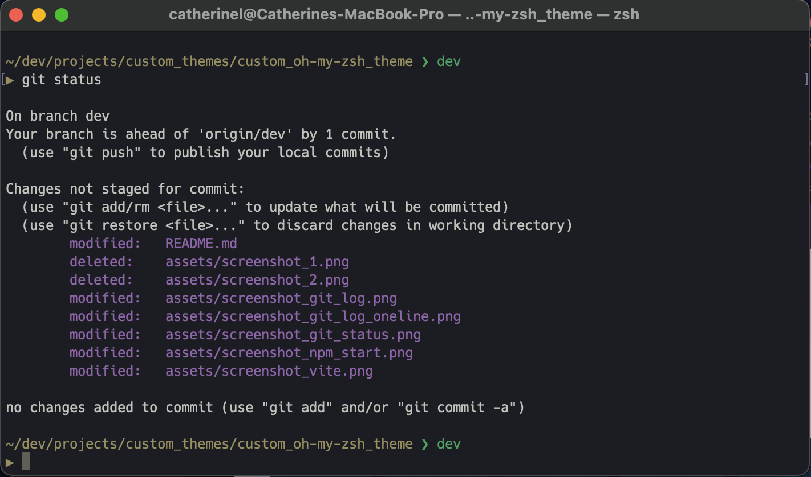

# Custom Minimalist Oh My Zsh Theme

<!--
Overview

1. Prerequisites
 -->

<div align="center">
  
  <br><br>
  
</div>

## Overview

1. [Description](#description)
2. [Prerequisites](#prerequisites)
3. [Installation](#installation)

<!-- 4. [Technologies Used](#technologies)
5. [Deliverables](#deliverables)
6. [Planning & Build Process](#planning)
7. [Challenges](#challenges)
8. [Wins](#wins)
9. [Key Learnings & Takeaways](#takeaways)
10. [Future Improvements](#future-improvements) -->

---

## <a name="description"></a> 1. Description

A sleek and minimalist **Oh My Zsh** theme for an enhanced terminal experience.

## <a name="prerequisites"></a> 2. Prerequisites

#### To use this theme, you must have:

- Oh My Zsh installed
- Zsh set as your default shell

#### Compatibility:

- Supported Platforms&nbsp;&nbsp;✅
  - macOS & Linux – Fully supported
  - Windows (WSL) – Supported with WSL + Nerd Fonts for proper icon rendering
- Not Supported&nbsp;&nbsp;❌
  - Git Bash – Oh My Zsh does not work in Git Bash
  - Windows CMD/PowerShell – Zsh is not natively supported
    - For the best experience on Windows, use WSL with Ubuntu and Windows Terminal

---

### **Check if Oh My Zsh is Installed**

- In your terminal, run:

  ```sh
  echo $ZSH
  ```

- If installed, it will return a path like:
  ```
  /Users/your-username/.oh-my-zsh
  ```
- If empty, **Oh My Zsh is not installed**.

---

### **Check if Zsh is the Default Shell**

- In your terminal, run:

  ```sh
  echo $SHELL
  ```

- If it returns `/bin/zsh`, Zsh is already set as the default shell.
- If it returns `/bin/bash`, switch to Zsh with:
  ```sh
  chsh -s $(which zsh)
  ```
- Then restart your terminal.

---

### **Verify Oh My Zsh Configuration**

- Check if the `~/.zshrc` file exists by running:

  ```sh
  ls -la ~/.zshrc
  ```

- If the file exists, **Oh My Zsh is installed**.
- If not, proceed with installation.

---

### **Install Oh My Zsh (If Needed)**

- If Oh My Zsh is not installed, install it with the following command:

  ```sh
  sh -c "$(curl -fsSL https://raw.github.com/ohmyzsh/ohmyzsh/master/tools/install.sh)"
  ```

- Or use `wget`:

  ```sh
  sh -c "$(wget https://raw.github.com/ohmyzsh/ohmyzsh/master/tools/install.sh -O -)"
  ```

- After installation, restart your terminal or run:

  ```sh
  source ~/.zshrc
  ```

## <a name="installation"></a> 3. Installing the Custom Oh My Zsh Theme

### **Step 1: Navigate to the Oh My Zsh Custom Themes Directory**

```sh
cd ~/.oh-my-zsh/custom/themes
```

- If the directory does not exist, create it:

  ```sh
  mkdir -p ~/.oh-my-zsh/custom/themes
  ```

### **Step 2: Download the Theme**

- #### **Option 1: Clone the Repository**

  ```sh
  git clone https://github.com/katieloesch/custom_oh-my-zsh_theme
  ```

- #### **Option 2: Download the Theme File Directly**

  - Using `curl`:

    ```sh
    curl -o ~/.oh-my-zsh/custom/themes/custom_zsh_theme.zsh-theme https://raw.githubusercontent.com/katieloesch/custom_oh-my-zsh_theme/main/custom_zsh_theme.zsh-theme
    ```

  - Using `wget`:

    ```sh
    wget -O ~/.oh-my-zsh/custom/themes/custom_zsh_theme.zsh-theme https://raw.githubusercontent.com/katieloesch/custom_oh-my-zsh_theme/main/custom_zsh_theme.zsh-theme
    ```

### **Step 3: Verify the Theme File**

- Ensure the file is in the correct directory:

  ```sh
  ls ~/.oh-my-zsh/custom/themes/
  ```

- You should see `custom_zsh_theme.zsh-theme` in the list.

### **Step 4: Set the Theme in `.zshrc`**

- Open the configuration file:

  ```sh
  open ~/.zshrc
  ```

- Find the line:

  ```sh
  ZSH_THEME="robbyrussell"
  ```

- Change it to:

  ```sh
  ZSH_THEME="custom_zsh_theme"
  ```

- Save and exit close the file.

### **Step 5: Apply Changes**

```sh
source ~/.zshrc
```

### **Troubleshooting**

- If the theme doesn’t apply, ensure the `.zsh-theme` file is in the correct location.
- Restart your terminal if `source ~/.zshrc` does not work.
