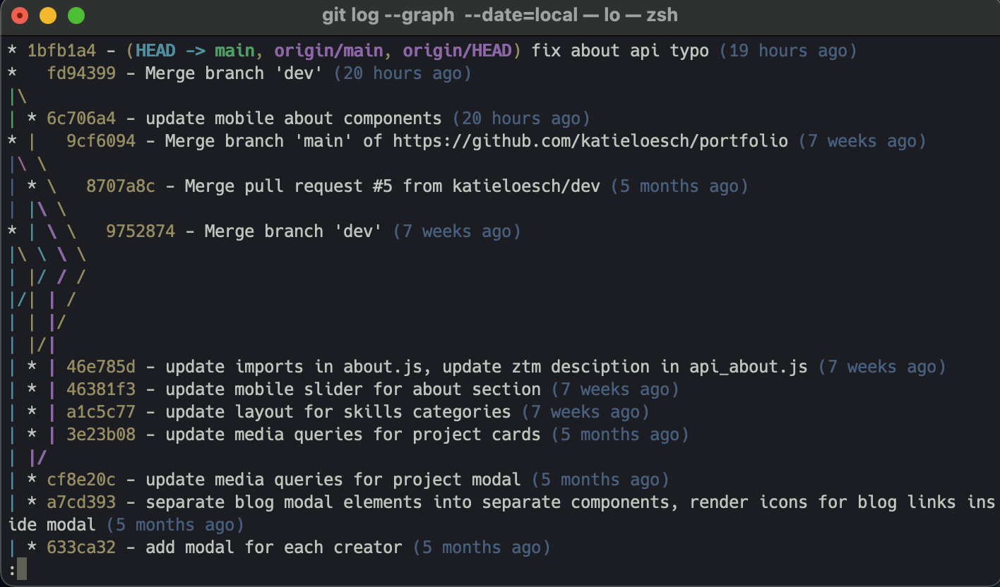
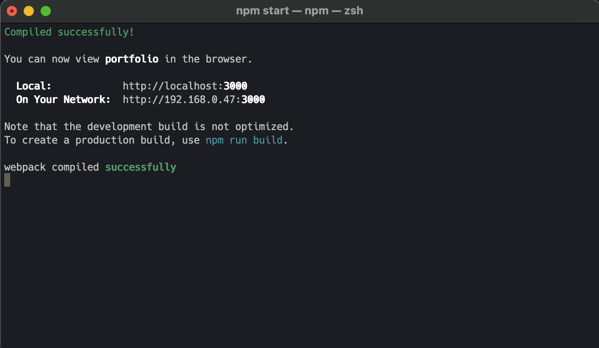

# Custom Minimalist Oh My Zsh Theme

<!--
Overview

1. Prerequisites
 -->

<div align="center">
  
  <br><br>
  
</div>

## Overview

1. [Description](#description)
2. [Prerequisites](#prerequisites)
3. [Installation - MacOS](#installation-mac)
4. [Installation - Linux](#installation-linux)
5. [Installation - WSL](#installation-wsl)

---

## <a name="description"></a> 1. Description

A sleek and minimalist **Oh My Zsh** theme designed for an enhanced terminal experience, inspired by the [Andromeda Mariana](https://marketplace.visualstudio.com/items?itemName=lakshits11.best-themes-redefined) theme for VS Code by [Lakshit Somani](https://github.com/lakshits11/).

Like Andromeda Mariana, this custom theme features a dark background, reducing overall screen brightness to minimize eye strain—especially in low-light environments. Its soft, muted color palette helps prevent visual fatigue by avoiding harsh contrasts, creating a comfortable and aesthetically pleasing workspace.

<div align="center">
  
  <br><br>
  
  <br><br>
  
</div>

## <a name="prerequisites"></a> 2. Prerequisites

### To use this theme, you must have:

- Oh My Zsh installed
- Zsh set as your default shell

### Compatibility:

✅&nbsp;&nbsp;Supported

- macOS & Linux – Fully supported
- Windows (WSL) – Supported with WSL + Nerd Fonts for proper icon rendering

<br>

❌&nbsp;&nbsp;Not Supported

- Git Bash – Oh My Zsh does not work in Git Bash
- Windows CMD/PowerShell – Zsh is not natively supported
  - For the best experience on Windows, use WSL with Ubuntu and Windows Terminal

---

### **Check if Oh My Zsh is Installed**

- In your terminal, run:

  ```sh
  echo $ZSH
  ```

- If installed, it will return a path like:
  ```
  /Users/your-username/.oh-my-zsh
  ```
- If empty, **Oh My Zsh is not installed**.

---

### **Check if Zsh is the Default Shell**

- In your terminal, run:

  ```sh
  echo $SHELL
  ```

- If it returns `/bin/zsh`, Zsh is already set as the default shell.
- If it returns `/bin/bash`, switch to Zsh with:
  ```sh
  chsh -s $(which zsh)
  ```
- Then restart your terminal.

---

### **Verify Oh My Zsh Configuration**

- Check if the `~/.zshrc` file exists by running:

  ```sh
  ls -la ~/.zshrc
  ```

- If the file exists, **Oh My Zsh is installed**.
- If not, proceed with installation.

---

### **Install Oh My Zsh (If Needed)**

- If Oh My Zsh is not installed, install it with the following command:

  ```sh
  sh -c "$(curl -fsSL https://raw.github.com/ohmyzsh/ohmyzsh/master/tools/install.sh)"
  ```

- Or use `wget`:

  ```sh
  sh -c "$(wget https://raw.github.com/ohmyzsh/ohmyzsh/master/tools/install.sh -O -)"
  ```

- After installation, restart your terminal or run:

  ```sh
  source ~/.zshrc
  ```

## <a name="installation-mac"></a> 3. Installing the Custom Oh My Zsh Theme on MacOS

### **Step 1: Navigate to the Oh My Zsh Custom Themes Directory**

```sh
cd ~/.oh-my-zsh/custom/themes
```

- If the directory does not exist, create it:

  ```sh
  mkdir -p ~/.oh-my-zsh/custom/themes
  ```

### **Step 2: Download the Theme**

- #### **Option 1: Clone the Repository**

  ```sh
  git clone https://github.com/katieloesch/custom_oh-my-zsh_theme
  ```

- #### **Option 2: Download the Theme File Directly**

  - Using `curl`:

    ```sh
    curl -o ~/.oh-my-zsh/custom/themes/custom_zsh_theme.zsh-theme https://raw.githubusercontent.com/katieloesch/custom_oh-my-zsh_theme/main/custom_zsh_theme.zsh-theme
    ```

  - Using `wget`:

    ```sh
    wget -O ~/.oh-my-zsh/custom/themes/custom_zsh_theme.zsh-theme https://raw.githubusercontent.com/katieloesch/custom_oh-my-zsh_theme/main/custom_zsh_theme.zsh-theme
    ```

### **Step 3: Verify the Theme File**

- Ensure the file is in the correct directory:

  ```sh
  ls ~/.oh-my-zsh/custom/themes/
  ```

- You should see `custom_zsh_theme.zsh-theme` in the list.

### **Step 4: Set the Theme in `.zshrc`**

- Open the configuration file:

  ```sh
  open ~/.zshrc
  ```

- Find the line:

  ```sh
  ZSH_THEME="robbyrussell"
  ```

- Change it to:

  ```sh
  ZSH_THEME="custom_zsh_theme"
  ```

- Save and exit close the file.

### **Step 5: Apply Changes**

```sh
source ~/.zshrc
```

### **Troubleshooting**

- If the theme doesn’t apply, ensure the `.zsh-theme` file is in the correct location.
- Restart your terminal if `source ~/.zshrc` does not work.

---

---

---

## <a name="installation-linux"></a> 4. Installing the Custom Oh My Zsh Theme on Linux

### **Check if Oh My Zsh is Installed**

Run:

```sh
echo $ZSH
```

- If installed, it will return a path like:
  ```
  /home/your-username/.oh-my-zsh
  ```
- If empty, **Oh My Zsh is not installed**.

---

### **Check if Zsh is the Default Shell**

Run:

```sh
echo $SHELL
```

- If it returns `/bin/zsh`, Zsh is already set as the default shell.
- If it returns `/bin/bash`, switch to Zsh with:
  ```sh
  chsh -s $(which zsh)
  ```
  Then restart your terminal.

---

### **Verify Oh My Zsh Configuration**

Check if the `~/.zshrc` file exists:

```sh
ls -la ~/.zshrc
```

- If the file exists, **Oh My Zsh is installed**.
- If not, proceed with installation.

---

### **Install Oh My Zsh (If Needed)**

Run:

```sh
sh -c "$(curl -fsSL https://raw.github.com/ohmyzsh/ohmyzsh/master/tools/install.sh)"
```

Or use `wget`:

```sh
sh -c "$(wget https://raw.github.com/ohmyzsh/ohmyzsh/master/tools/install.sh -O -)"
```

After installation, restart your terminal or run:

```sh
source ~/.zshrc
```

---

## **2. Install the Custom Oh My Zsh Theme**

### **Step 1: Navigate to the Oh My Zsh Custom Themes Directory**

```sh
cd ~/.oh-my-zsh/custom/themes
```

If the directory does not exist, create it:

```sh
mkdir -p ~/.oh-my-zsh/custom/themes
```

### **Step 2: Download the Theme**

#### **Option 1: Clone the Repository**

```sh
git clone https://github.com/katieloesch/custom_oh-my-zsh_theme
```

#### **Option 2: Download the Theme File Directly**

Using `curl`:

```sh
curl -o ~/.oh-my-zsh/custom/themes/custom_zsh_theme.zsh-theme https://raw.githubusercontent.com/katieloesch/custom_oh-my-zsh_theme/main/custom_zsh_theme.zsh-theme
```

Using `wget`:

```sh
wget -O ~/.oh-my-zsh/custom/themes/custom_zsh_theme.zsh-theme https://raw.githubusercontent.com/katieloesch/custom_oh-my-zsh_theme/main/custom_zsh_theme.zsh-theme
```

### **Step 3: Verify the Theme File**

Ensure the file is in the correct directory:

```sh
ls ~/.oh-my-zsh/custom/themes/
```

You should see `custom_zsh_theme.zsh-theme` in the list.

### **Step 4: Set the Theme in `.zshrc`**

Open the configuration file:

```sh
nano ~/.zshrc
```

Find the line:

```sh
ZSH_THEME="robbyrussell"
```

Change it to:

```sh
ZSH_THEME="custom_zsh_theme"
```

Save and exit (`CTRL + X`, then `Y`, then `ENTER`).

### **Step 5: Apply Changes**

```sh
source ~/.zshrc
```

---

## **Troubleshooting**

- If the theme doesn’t apply, ensure the `.zsh-theme` file is in the correct location.
- Restart your terminal if `source ~/.zshrc` does not work.
- Some themes require **Nerd Fonts**—install one if your icons aren’t displaying correctly.

---

## <a name="installation-wsl"></a> 5. Installing the Custom Oh My Zsh Theme on WSL

## **Prerequisites**

To use this theme, you must have:

- **WSL Installed** (Windows Subsystem for Linux)
- **Ubuntu or another Linux distro installed in WSL**
- **Oh My Zsh** installed
- **Zsh** set as your default shell
- **Windows Terminal (recommended for best results)**

---

## **1. Install and Configure WSL**

### **Step 1: Enable WSL**

Run the following command in **PowerShell (Admin)**:

```powershell
wsl --install
```

Restart your computer.

### **Step 2: Install Ubuntu (or another Linux distro)**

Open **PowerShell** and run:

```powershell
wsl --install -d Ubuntu
```

Launch **Ubuntu** from the Start menu and complete the setup.

### **Step 3: Install Zsh**

Inside your **Ubuntu terminal**:

```sh
sudo apt update && sudo apt install zsh -y
```

### **Step 4: Install Oh My Zsh**

```sh
sh -c "$(curl -fsSL https://raw.github.com/ohmyzsh/ohmyzsh/master/tools/install.sh)"
```

Or use `wget`:

```sh
sh -c "$(wget https://raw.github.com/ohmyzsh/ohmyzsh/master/tools/install.sh -O -)"
```

### **Step 5: Set Zsh as the Default Shell**

```sh
chsh -s $(which zsh)
```

Restart your **Windows Terminal** to apply changes.

---

## **2. Install the Custom Oh My Zsh Theme**

### **Step 1: Navigate to the Oh My Zsh Custom Themes Directory**

```sh
cd ~/.oh-my-zsh/custom/themes
```

If the directory does not exist, create it:

```sh
mkdir -p ~/.oh-my-zsh/custom/themes
```

### **Step 2: Download the Theme**

#### **Option 1: Clone the Repository**

```sh
git clone https://github.com/katieloesch/custom_oh-my-zsh_theme
```

#### **Option 2: Download the Theme File Directly**

Using `curl`:

```sh
curl -o ~/.oh-my-zsh/custom/themes/custom_zsh_theme.zsh-theme https://raw.githubusercontent.com/katieloesch/custom_oh-my-zsh_theme/main/custom_zsh_theme.zsh-theme
```

Using `wget`:

```sh
wget -O ~/.oh-my-zsh/custom/themes/custom_zsh_theme.zsh-theme https://raw.githubusercontent.com/katieloesch/custom_oh-my-zsh_theme/main/custom_zsh_theme.zsh-theme
```

### **Step 3: Verify the Theme File**

```sh
ls ~/.oh-my-zsh/custom/themes/
```

You should see `custom_zsh_theme.zsh-theme` in the list.

### **Step 4: Set the Theme in `.zshrc`**

```sh
nano ~/.zshrc
```

Find:

```sh
ZSH_THEME="robbyrussell"
```

Change it to:

```sh
ZSH_THEME="custom_zsh_theme"
```

Save and exit.

### **Step 5: Apply Changes**

```sh
source ~/.zshrc
```

---

## **Troubleshooting**

- Install **MesloLGS NF** (Nerd Font) for proper icon rendering.
- Ensure **Windows Terminal** is used for full color support.
